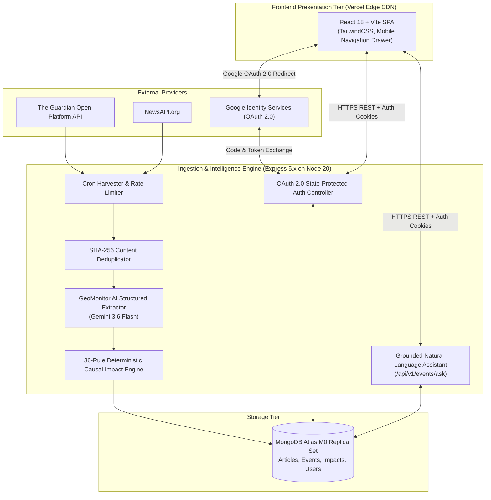

# GeoMonitor — System Architecture & Deep Dive

---

## 1. Architectural Philosophy & Design Principles

GeoMonitor is designed as a **hybrid deterministic-AI intelligence platform**:
1. **AI for Perception & Extraction**: Leverages Large Language Models (`gemini-3.6-flash`) for natural language comprehension and structured entity/fact extraction from messy news articles.
2. **Deterministic Rules for Causal Impact**: Uses a hardened 36-rule causal mapping matrix to evaluate multi-domain economic ripple effects without LLM hallucination or arbitrary scoring.
3. **Grounded Synthesis for Executive Q&A**: Uses retrieval-augmented generation (RAG) strictly grounded in verified database dossiers with explicit citations `[Event 1]`, `[Event 2]`.
4. **Zero-Trust Security**: Standard Google OAuth 2.0 with cryptographic CSRF state parameters, official token verification (`google-auth-library`), and secure HTTP-only cookies.

---

## 2. End-to-End System Architecture



---

## 3. Subsystem Breakdown

### 3.1 Ingestion & Content Deduplication
- **Harvester (`cronScheduler.js`)**: Runs on a configurable cron schedule (`0 */2 * * *`), querying upstream endpoints with topic tags (`world`, `geopolitics`, `trade`, `sanctions`).
- **Cryptographic Hash Matcher**: Generates `SHA-256(normalize(title) + url)` stored in a unique MongoDB index. Any duplicate article is discarded at zero database write cost before reaching LLM inference.
- **Pre-Filtering**: Rejects articles with relevance score $< 0.3$.

### 3.2 Structured Event Extraction (GeoMonitor AI)
- Uses `@google/genai` (Gemini 3.6 Flash) with structured JSON output enforcing:
  - `eventType`: 14 geopolitical classification categories.
  - `entities`: Key state actors, corporations, leaders.
  - `countries` & `regions`: Standardized geographic tags.
  - `sectors`: Targeted industry domains.
  - `severity`: `LOW`, `MEDIUM`, `HIGH`, `CRITICAL`.
  - `facts`: Minimum 3 verifiable factual statements.

### 3.3 Deterministic Causal Impact Engine
- Applies 36 causal propagation rules mapping event types and countries to **13 domains**:
  1. `ENERGY`
  2. `FINANCIAL_MARKETS`
  3. `SUPPLY_CHAIN`
  4. `DEFENSE`
  5. `FOOD_AGRICULTURE`
  6. `TECHNOLOGY`
  7. `HEALTHCARE`
  8. `INFRASTRUCTURE`
  9. `LABOR_IMMIGRATION`
  10. `ENVIRONMENT_CLIMATE`
  11. `CYBERSECURITY`
  12. `CRITICAL_MINERALS`
  13. `TOURISM_AVIATION`
- Outputs directional tags: `POSITIVE_OPPORTUNITY`, `DE_ESCALATION`, `RISK_INCREASE`, `DOWNSIDE_SHOCK`.

### 3.4 Grounded AI Assistant (Ask GeoMonitor AI)
- Query endpoint: `POST /api/v1/events/ask`.
- Searches MongoDB Atlas dossiers using keyword filtering across summaries, countries, and sectors.
- Constructs an executive context prompt incorporating candidate events and active impact evaluations.
- Synthesizes a grounded brief with citations `[Event 1]`, `[Event 2]` linking directly to event dossiers.

### 3.5 Authentication & Session Architecture
- **Google OAuth 2.0 / OpenID Connect**:
  - `GET /api/v1/auth/google`: Generates 32-byte cryptographic random `state`, sets HTTP-only `oauth_state` cookie, redirects to `accounts.google.com`.
  - `GET /api/v1/auth/google/callback`: Validates state against cookie, exchanges code for Google ID token, verifies signature and audience with `google-auth-library`, provisions user by `googleId` (`sub` claim).
  - Sets signed JWT in secure HTTP-only cookie (`token`, `SameSite: None` in prod, `Secure: true`).

---

## 4. Database Schema & Indexing Strategy

```
Articles ──── (1:1) ────► Events ──── (1:N) ────► ImpactAssessments
                            ▲
                            │ (M:N via bookmarks)
                          Users
```

- **Compound Indexes**:
  - `events`: `{ createdAt: -1 }`, `{ severity: 1, createdAt: -1 }`, `{ countries: 1 }`, `{ sectors: 1 }`
  - `impact_assessments`: `{ eventId: 1, supersededAt: 1 }`, `{ domain: 1, direction: 1 }`
  - `articles`: `{ contentHash: 1 }` (unique), `{ url: 1 }` (unique)
  - `users`: `{ email: 1 }` (unique), `{ googleId: 1 }` (sparse)

---

## 5. Cost Optimization & Free-Tier Guardrails

- **LLM Rate Limiting**: Inter-batch sleep of 4000ms ensures compliance with free-tier rate limits (15 RPM).
- **MongoDB Atlas M0**: Zero hosting cost with 512MB storage (sufficient for ~50,000 structured dossiers).
- **Vercel Edge & Render Web Service**: Free-tier cloud hosting with automatic SSL and zero SaaS authentication fees.
