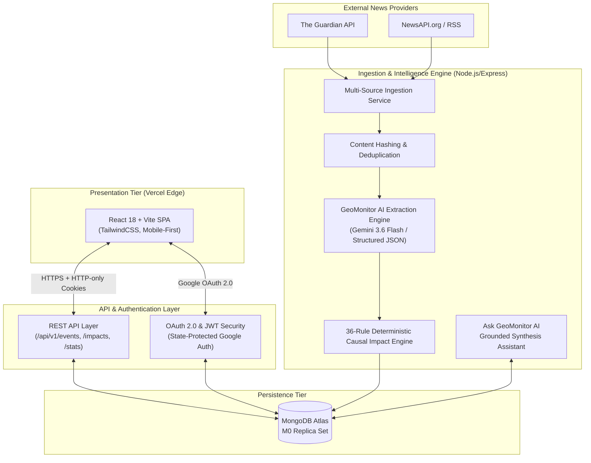
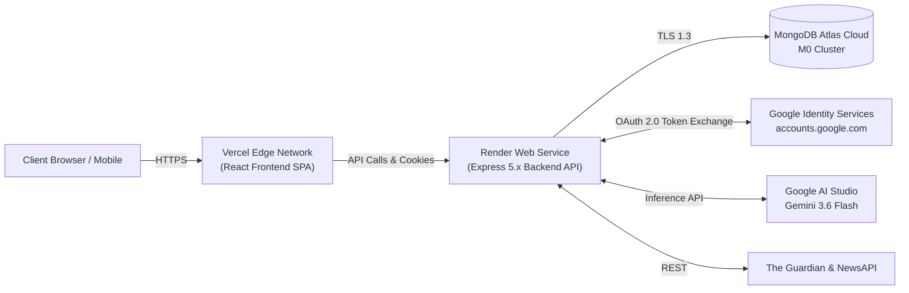

# GeoMonitor — High-Level Design (HLD)

---

## 1. Executive Summary & Problem Statement

### 1.1 Problem Statement
Geopolitical developments (sanctions, military conflicts, treaties, critical mineral restrictions, elections) create rapid, cascading shocks across interconnected global supply chains, energy markets, semiconductor fabrication, and trade corridors. Existing intelligence solutions are either costly enterprise terminals ($25k+/yr) or fragmented news feeds that lack causal impact modeling.

### 1.2 Solution Overview
**GeoMonitor** is an automated, real-time geopolitical intelligence monitoring and causal impact assessment platform. It ingests international wire feeds, extracts structured geopolitical events via LLM synthesis, deterministically maps multi-domain economic impacts across 13 sectors (such as Energy, Semiconductors, Defense, Trade), and provides natural language intelligence query assistance through a modern, mobile-first web interface.

---

## 2. System Architecture

---

## 3. Core Component Subsystems

### 3.1 Ingestion & Normalization Subsystem
- **Scheduled Harvester (`cronScheduler.js`)**: Polls upstream sources on configurable intervals (`INGESTION_CRON`).
- **Deduplication Engine**: Computes SHA-256 hashes of normalized titles and URLs (`contentHash`) to prevent redundant processing.
- **Relevance Gatekeeper**: Pre-filters non-geopolitical articles using keyword matching and relevance thresholds before triggering LLM calls.

### 3.2 Structured Extraction & AI Subsystem
- **Structured Schema Enforcer**: Prompts the LLM (`gemini-3.6-flash`) with strict JSON schema definitions for entities, countries, sectors, severity (`LOW`, `MEDIUM`, `HIGH`, `CRITICAL`), credibility, and factual summaries.
- **Deterministic Causal Impact Engine (`impactRules.js`)**: Evaluates extracted event properties against 36 causal propagation rules across 13 domains (e.g., `SANCTION` against energy exporters triggers energy price shock and supply chain disruption).

### 3.3 Authentication & Security Subsystem
- **Standard Google OAuth 2.0 / OpenID Connect**:
  - Implements anti-CSRF state protection using cryptographically random 32-byte state cookies.
  - Cryptographically validates Google ID tokens (`google-auth-library`) verifying signature, audience, and issuer.
  - Provisions users using Google's immutable `sub` claim without fake passwords.
- **Session Management**: Issues signed JWTs in secure, HTTP-only, SameSite cookies.
- **Zero Secrets on Client**: All client secrets, database URIs, and LLM keys remain strictly in backend environment variables.

### 3.4 Public REST API & Grounded RAG Subsystem
- **REST Endpoints**: High-performance, paginated, indexed queries for `/events`, `/impacts`, `/sources`, `/stats`.
- **Grounded Intelligence Assistant (`POST /api/v1/events/ask`)**: Retrieves candidate MongoDB dossiers, constructs grounded context, and synthesizes executive briefings citing specific live dossiers `[Event 1]`, `[Event 2]`.

---

## 4. Deployment Topology & Cloud Infrastructure

---

## 5. Non-Functional Requirements & Budget Compliance

- **Budget Cap**: ₹0 added cost (strictly within ₹500 lifetime project budget).
- **Latency Targets**:
  - Public Feed Queries (`GET /events`): `< 60ms` (P95)
  - Grounded AI Synthesis (`POST /events/ask`): `< 1200ms` (P95)
- **High Availability**: Stateless backend design allowing horizontal scaling; MongoDB Atlas 3-node replica set with automated failover.
- **Resilience**: Exponential backoff with jitter on external news APIs and LLM rate-limit handling (4000ms inter-batch delay).
