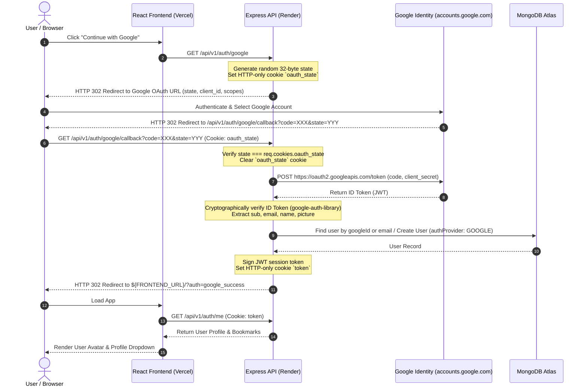
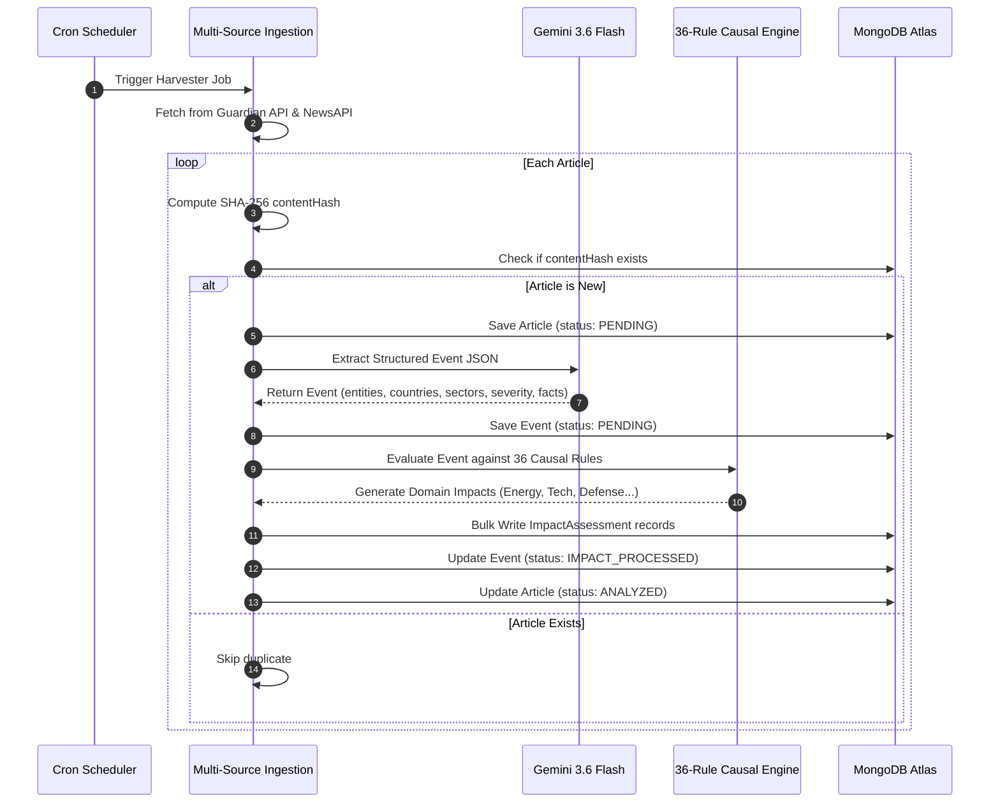

# GeoMonitor — Low-Level Design (LLD)

---

## 1. Data Models & Database Schema (Mongoose)

### 1.1 `Article` Model
Tracks ingested raw news items, deduplication hashes, and processing states.

```typescript
interface IArticle {
  _id: ObjectId;
  sourceId: ObjectId;          // Ref: 'Source' (indexed)
  title: string;               // Required, trimmed
  url: string;                 // Required, unique index
  content: string;             // Full text / excerpt
  publishedAt: Date;           // Required, indexed
  relevanceScore: number;      // 0.0 - 1.0 (pre-filter score)
  contentHash: string;         // SHA-256(normalizedTitle + url), unique index
  processingStatus: 'PENDING' | 'ANALYZED' | 'FAILED' | 'SKIPPED';
  processingAttempts: number;  // Default: 0
  lastError?: string;
  createdAt: Date;
  updatedAt: Date;
}
```
**Indexes**: `{ contentHash: 1 }` (unique), `{ url: 1 }` (unique), `{ sourceId: 1, publishedAt: -1 }`.

---

### 1.2 `Event` Model
Represents structured geopolitical events extracted by the AI Engine.

```typescript
interface IEvent {
  _id: ObjectId;
  primaryArticleId: ObjectId;  // Ref: 'Article' (indexed)
  articleIds: ObjectId[];      // Ref: 'Article'[] (multi-source cluster)
  eventType: 'SANCTION' | 'ELECTION' | 'MILITARY_CONFLICT' | 'TREATY' |
             'DIPLOMATIC_AGREEMENT' | 'EXPORT_RESTRICTION' | 'IMPORT_RESTRICTION' |
             'TRADE_RESTRICTION' | 'POLICY_CHANGE' | 'POLITICAL_CRISIS' |
             'RESOURCE_DISRUPTION' | 'INTERNATIONAL_DISPUTE' |
             'GEOPOLITICAL_ANNOUNCEMENT' | 'OTHER';
  summary: string;             // 2-3 sentence factual brief
  entities: string[];          // Leaders, agencies, corporations
  countries: string[];         // Affected countries (indexed)
  regions: string[];           // Geographic regions
  sectors: string[];           // Impacted industry sectors
  facts: string[];             // Concrete verifiable bullet points
  severity: 'LOW' | 'MEDIUM' | 'HIGH' | 'CRITICAL';
  credibilityScore: number;    // 0.0 - 1.0
  credibilityLabel: 'CONFIRMED' | 'LIKELY' | 'UNVERIFIED';
  processingStatus: 'PENDING' | 'IMPACT_PROCESSED' | 'FAILED';
  createdAt: Date;             // Indexed for feed sorting
  updatedAt: Date;
}
```
**Indexes**: `{ createdAt: -1 }`, `{ severity: 1, createdAt: -1 }`, `{ countries: 1 }`, `{ sectors: 1 }`.

---

### 1.3 `ImpactAssessment` Model
Represents causal multi-domain economic and strategic impact evaluations.

```typescript
interface IImpactAssessment {
  _id: ObjectId;
  eventId: ObjectId;           // Ref: 'Event' (indexed)
  domain: 'ENERGY' | 'FINANCIAL_MARKETS' | 'SUPPLY_CHAIN' | 'DEFENSE' |
          'FOOD_AGRICULTURE' | 'TECHNOLOGY' | 'HEALTHCARE' | 'INFRASTRUCTURE' |
          'LABOR_IMMIGRATION' | 'ENVIRONMENT_CLIMATE' | 'CYBERSECURITY' |
          'CRITICAL_MINERALS' | 'TOURISM_AVIATION';
  severity: 'LOW' | 'MEDIUM' | 'HIGH' | 'CRITICAL';
  direction: 'POSITIVE_OPPORTUNITY' | 'DE_ESCALATION' | 'RISK_INCREASE' | 'DOWNSIDE_SHOCK';
  explanation: string;         // Causal rationale
  confidenceScore: number;     // 0.0 - 1.0
  version: number;             // Schema versioning
  supersededAt?: Date;         // Null if active; set when updated
  createdAt: Date;
}
```
**Indexes**: `{ eventId: 1, supersededAt: 1 }`, `{ domain: 1, direction: 1 }`.

---

### 1.4 `User` Model
Stores authenticated reader accounts, Google OAuth profiles, and bookmarks.

```typescript
interface IUser {
  _id: ObjectId;
  name: string;                // Required
  email: string;               // Required, unique index, lowercase
  passwordHash?: string;       // bcrypt hash (omitted for Google-only users)
  googleId?: string;           // Google sub ID (indexed, sparse)
  avatar?: string;             // Profile image URL
  role: 'USER' | 'ADMIN';      // Default: 'USER'
  authProvider: 'LOCAL' | 'GOOGLE' | 'BOTH';
  bookmarks: ObjectId[];       // Ref: 'Event'[]
  preferences: {
    followedCountries: string[];
    followedDomains: string[];
  };
  createdAt: Date;
  updatedAt: Date;
}
```

---

## 2. Sequence Diagrams

### 2.1 Google OAuth 2.0 Authorization Code Flow (with CSRF State Protection)



---

### 2.2 Ingestion & Deterministic Causal Impact Processing



---

## 3. Causal Impact Rules Engine Specification

The engine evaluates events through **36 deterministic rules** across **13 domains**:

### 3.1 Causal Mapping Sample Matrix

| Event Type | Condition (Countries / Sectors) | Impact Domain | Direction | Severity Multiplier |
|---|---|---|---|---|
| `SANCTION` | Energy producer (Russia, Iran, Venezuela) | `ENERGY` | `DOWNSIDE_SHOCK` | `1.0 × EventSeverity` |
| `EXPORT_RESTRICTION` | Critical minerals (China, Australia, Chile) | `CRITICAL_MINERALS` | `DOWNSIDE_SHOCK` | `0.9 × EventSeverity` |
| `EXPORT_RESTRICTION` | Semiconductors / lithography equipment | `TECHNOLOGY` | `DOWNSIDE_SHOCK` | `1.0 × EventSeverity` |
| `TREATY` | Free trade / tariff elimination | `TRADE` | `POSITIVE_OPPORTUNITY` | `0.85 × EventSeverity` |
| `DIPLOMATIC_AGREEMENT` | Maritime / corridor security accord | `SUPPLY_CHAIN` | `DE_ESCALATION` | `0.80 × EventSeverity` |
| `MILITARY_CONFLICT` | Maritime choke point (Red Sea, Hormuz, Taiwan) | `SUPPLY_CHAIN` | `DOWNSIDE_SHOCK` | `1.0 × EventSeverity` |

### 3.2 Confidence Score Formula
\[
\text{Confidence} = \min\left(0.98, \; \text{EventCredibility} \times \text{SourceReliability} \times (1 - 0.05 \times \Delta_{\text{days}})\right)
\]

---

## 4. API Endpoints Contract

| Method | Endpoint | Description | Auth Required |
|---|---|---|---|
| `GET` | `/api/v1/health` | Service health status & timestamp | No |
| `GET` | `/api/v1/events` | Paginated event feed with search & filters | No |
| `GET` | `/api/v1/events/:id` | Single event dossier with populated impacts | No |
| `GET` | `/api/v1/events/:id/impacts` | List all active impact assessments for event | No |
| `POST` | `/api/v1/events/ask` | Grounded AI synthesis assistant | No |
| `GET` | `/api/v1/impacts` | Cross-event impact assessments | No |
| `GET` | `/api/v1/sources` | News wire sources & reliability ratings | No |
| `GET` | `/api/v1/stats` | Aggregated metrics & domain distributions | No |
| `GET` | `/api/v1/stats/countries` | Country risk & event concentration matrix | No |
| `POST` | `/api/v1/auth/register` | Email/password user registration | No |
| `POST` | `/api/v1/auth/login` | Email/password user login | No |
| `POST` | `/api/v1/auth/logout` | Clears HTTP-only session cookie | Yes |
| `GET` | `/api/v1/auth/me` | Fetch authenticated user profile | Optional |
| `GET` | `/api/v1/auth/google` | Initiates Google OAuth 2.0 flow | No |
| `GET` | `/api/v1/auth/google/callback` | Google OAuth code callback & verification | No |
| `POST` | `/api/v1/users/bookmarks/:id`| Toggle event bookmark for user | Yes |
| `GET` | `/api/v1/users/bookmarks` | List all bookmarked events | Yes |

---

## 5. Verification & Testing Strategy

The test suite runs via **Vitest** + **Supertest** + **MongoDB Memory Server**:
- **Unit Tests**: Schema validation, password hashing, JWT signing/verifying, regex escaping, and causal rule evaluation.
- **Integration Tests**: Full HTTP request/response validation across all endpoints, rate limiting, and CSRF state validation.
- **Current Coverage**: **163 passing tests** across 8 test suites (`npm test`).
